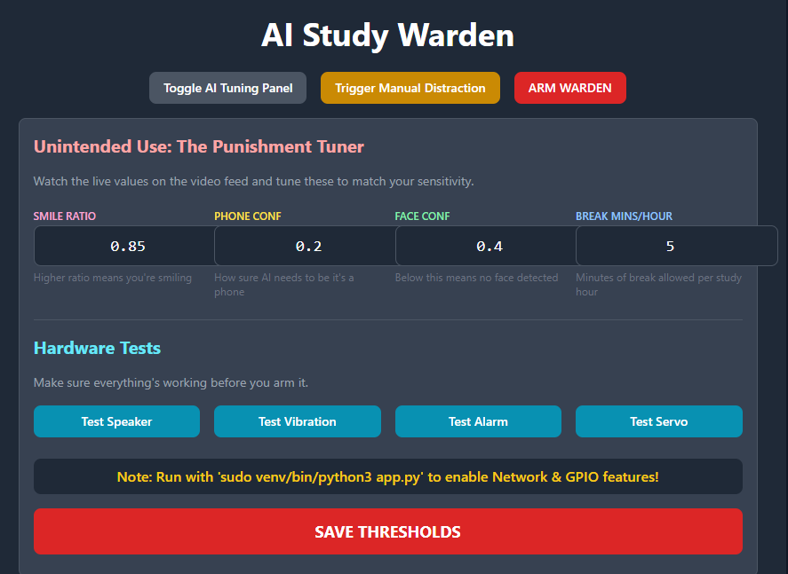

# Study Warden

[](LICENSE)

An AI-powered study monitoring system using Raspberry Pi that detects distractions and helps maintain focus. Uses computer vision, facial recognition, and object detection to monitor your study sessions in real-time. Made by Krystian Filipek.

<div align="center">


</div>

## Features

- **AI-Powered Distraction Detection**: Uses YOLO object detection to identify phones and other distracting items.
- **Facial Recognition**: Monitors face presence and expressions to determine if you're actually studying.
- **Network Monitoring**: Sniffs DNS traffic to detect visits to distracting websites (YouTube, Reddit, etc.).
- **Real-Time Web Interface**: View live camera feed and study statistics through a web dashboard.
- **Hardware Punishment System**: Multi-stage punishment sequence with speaker, alarm, vibration motor, and servo mechanism.
- **Configurable Thresholds**: Adjust AI sensitivity settings through the web interface.

<div align="center">



</div>

## Technical Implementation

The project combines computer vision AI models with hardware control to create an interactive study monitoring system.

| Component | Detail |
|---|---|
| **Microcontroller** | Raspberry Pi (with GPIO support) |
| **Framework** | Flask Web Server |
| **Language** | Python |
| **Face Detection** | dlib frontal face detector |
| **Object Detection** | YOLOv4-tiny with COCO dataset |
| **Network Monitoring** | Scapy DNS packet sniffer |
| **Hardware Control** | gpiozero library with lgpio backend |
| **Camera** | Picamera2 |

## Getting Started

### Prerequisites

- Raspberry Pi (tested with models that support lgpio)
- Python 3.x
- Raspberry Pi Camera Module
- Root/sudo access (required for GPIO and network sniffing)

### Installation

1. Clone the repository:
   ```sh
   git clone https://github.com/kfilipekk/Study_Warden.git
   cd Study_Warden
   ```

2. Install required Python packages:
   ```sh
   pip install flask opencv-python dlib numpy picamera2 gpiozero scapy
   ```

3. Download required AI models:
   - dlib shape predictor: `shape_predictor_68_face_landmarks.dat`
   - YOLOv4-tiny: `yolov4-tiny.cfg` and `yolov4-tiny.weights`
   - COCO names: `coco.names`

4. Run the application (requires sudo for GPIO and network monitoring):
   ```sh
   sudo python3 app.py
   ```

5. Access the web interface at `http://<raspberry-pi-ip>:5000`

## Requirements

- **Hardware**:
  - Raspberry Pi (with GPIO pins)
  - Raspberry Pi Camera Module
  - Buzzer/Speaker (GPIO pin 0)
  - Vibration Motor (GPIO pin 5)
  - Alarm Buzzer (GPIO pin 6)
  - Servo Motor (GPIO pin 13)
  - External power supply for motors (if needed)
  - Breadboard and jumper wires
- **Software**:
  - Python 3.x
  - Flask
  - OpenCV
  - dlib
  - Picamera2
  - gpiozero with lgpio
  - Scapy

## Applications

I made this project to:
- Improve my focus and productivity during study sessions through accountability.
- Combine AI/computer vision with physical hardware control in a practical application.
- Learn real-time video processing and multi-threaded Python programming.
- Explore network packet analysis and DNS monitoring.
- Because having an AI overseer keeping you accountable is both helpful and slightly terrifying.

## How It Works

1. **Video Monitoring**: Continuously captures video and processes frames through AI models.
2. **Face Detection**: Detects your face and analyzes expressions (smile detection for distraction).
3. **Object Detection**: Identifies phones and other distracting items in view.
4. **Network Sniffing**: Monitors DNS requests to catch visits to distracting websites.
5. **Status Tracking**: Categorizes your state as STUDYING, BREAK, or DISTRACTED.
6. **Punishment System**: If distracted for >5 seconds while armed, triggers a multi-stage punishment sequence.

## Configuration

Adjust AI thresholds through the web interface:
- **Smile Threshold**: Sensitivity for detecting smiles (default: 1.80)
- **Phone Confidence**: Minimum confidence for phone detection (default: 0.30)
- **Face Confidence**: Minimum confidence for face detection (default: 0.5)
- **Break Ratio**: Allowed break time per hour of study (default: 1.0 min/hour)

<div align="center">

Developed by [kfilipekk](https://github.com/kfilipekk)

</div>
